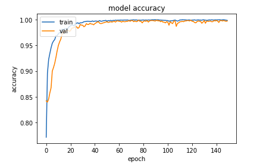

# MolecularClassifier
 Our goal is to classifies whether the chemical compound is 'Musk' or 'Non-Musk' using deep neural network.
 
## Dataset
The dataset contains details about organic chemical compounds including their chemical features, isomeric conformation, names and the classes in which they are classified. The compounds are classified as either ‘Musk’ or ‘Non-Musk’ compounds.

## Implementation
Please have a look at [molecular_classifier.ipynb](molecular_classifier.ipynb)

## Results
The source of results is present in [molecular_classifier.ipynb](molecular_classifier.ipynb)

Final performance measures of our model.

| Metric | Performance |
| - | - |
| Validation accuracy   |   0.99772 |
| Validation loss       |   0.00714 |
| Validation precision  |   0.99762 |
| Validation recall     |   0.99762 |
| Validation f1 score   |   0.99762 |

### Graphs

